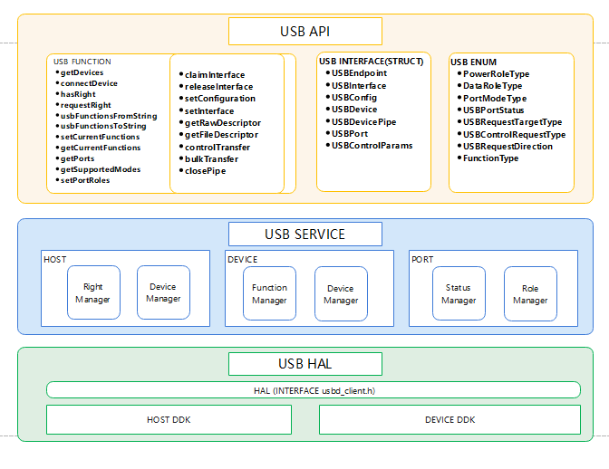

# USB服务子系统概述

-   [概述](#section175431838101617)
-   [接口说明](#section83365421647)
    -   [Host部分](#section83365421658)
    -   [Device部分](#section83365421669)
    -   [Port部分](#section83365421670)

## 概述

  USB设备分为Host设备（主机设备）和Device设备（从设备）。用户可通过Port Service来根据实际业务把运行OpenHarmony的设备切换为Host设备或者Device设备。目前在Host模式下，支持获取USB设备列表，USB设备权限管理，控制传输、批量传输的同异步数据传输等，在Device模式下，支持HDC（调试）、ACM（串口）、ECM（网口）等功能的切换。

**图1**  USB服务架构图

-   USB FWK/API：基于USB Service服务，使用NAPI技术，向上提供JS接口。
-   USB Service：使用C++代码实现，包含Host、Device、Port三个模块。基于HDI的接口，主要实现USB设备的列表管理、Function 管理、Port管理、USB设备权限管理等功能。
-   USB HAL：使用C代码实现，基于Host SDK和Device SDK，封装了对USB设备的基本操作，向上提供C++接口，同时通过HDF框架接收内核上报的信息。

## 接口说明

- ### Host部分

<table><thead align="left"><tr id="row171321857155517"><th class="cellrowborder" valign="top" width="10.721072107210723%" id="mcps1.2.4.1.1">
头文件

</th>
<th class="cellrowborder" valign="top" width="66.36663666366637%" id="mcps1.2.4.1.2">
接口名称

</th>
<th class="cellrowborder" valign="top" width="22.912291229122914%" id="mcps1.2.4.1.3">
功能描述

</th>
</tr>
</thead>
<tbody><tr id="row13132357165514"><td class="cellrowborder" rowspan="16" valign="top" width="10.721072107210723%" headers="mcps1.2.4.1.1 ">
usb_srv_client.h

</td>
<td class="cellrowborder" valign="top" width="66.36663666366637%" headers="mcps1.2.4.1.1 ">
int32_t OpenDevice(const UsbDevice &device, USBDevicePipe &pip);

</td>
<td class="cellrowborder" valign="top" headers="mcps1.2.4.1.2 ">
打开USB设备，建立连接

</td>
</tr>
<tr id="row171331657185514"><td class="cellrowborder" valign="top" headers="mcps1.2.4.1.1 ">
int32_t HasRight(std::string deviceName);

</td>
<td class="cellrowborder" valign="top" headers="mcps1.2.4.1.2 ">
判断是否有权访问设备

</td>
</tr>
<tr id="row41331557165518"><td class="cellrowborder" valign="top" headers="mcps1.2.4.1.1 ">
int32_t RequestRight(std::string deviceName);

</td>
<td class="cellrowborder" valign="top" headers="mcps1.2.4.1.2 ">
请求给定软件包的临时权限以访问设备

</td>
</tr>
<tr id="row77021769584"><td class="cellrowborder" valign="top" headers="mcps1.2.4.1.1 ">
int32_t GetDevices(std::vector<UsbDevice> &deviceList);

</td>
<td class="cellrowborder" valign="top" headers="mcps1.2.4.1.2 ">
获取USB设备列表

</td>
</tr>
<tr id="row71857914585"><td class="cellrowborder" valign="top" headers="mcps1.2.4.1.1 ">
int32_t ClaimInterface(USBDevicePipe &pip, const UsbInterface &interface, bool force);

</td>
<td class="cellrowborder" valign="top" headers="mcps1.2.4.1.2 ">
打开接口，并申明独占接口，必须在数据传输前执行

</td>
</tr>
<tr id="row18831119115815"><td class="cellrowborder" valign="top" headers="mcps1.2.4.1.1 ">
int32_t ReleaseInterface(USBDevicePipe &pip, const UsbInterface &interface);

</td>
<td class="cellrowborder" valign="top" headers="mcps1.2.4.1.2 ">
关闭接口，释放接口的占用，在停止数据传输后执行

</td>
</tr>
<tr id="row71857914585"><td class="cellrowborder" valign="top" headers="mcps1.2.4.1.1 ">
int32_t BulkTransfer(USBDevicePipe &pip, const USBEndpoint &endpoint, std::vector<uint8_t> &vdata, int32_t timeout);

</td>
<td class="cellrowborder" valign="top" headers="mcps1.2.4.1.2 ">
在给定端点上执行批量数据传输， 返回读取或发送的数据长度，通过端点方向确定读取或发送数据

</td>
</tr>
<tr id="row18831119115815"><td class="cellrowborder" valign="top" headers="mcps1.2.4.1.1 ">
int32_t ControlTransfer(USBDevicePipe &pip, const UsbCtrlTransfer &ctrl, std::vector<uint8_t> &vdata);

</td>
<td class="cellrowborder" valign="top" headers="mcps1.2.4.1.2 ">
对此设备执行端点零的控制事务，传输方向由请求类型决定

</td>
</tr>
<tr id="row71857914585"><td class="cellrowborder" valign="top" headers="mcps1.2.4.1.1 ">
int32_t SetConfiguration(USBDevicePipe &pip, const USBConfig &config);

</td>
<td class="cellrowborder" valign="top" headers="mcps1.2.4.1.2 ">
设置设备当前使用的配置，通过配置值进行指定

</td>
</tr>
<tr id="row18831119115815"><td class="cellrowborder" valign="top" headers="mcps1.2.4.1.1 ">
int32_t SetInterface(USBDevicePipe &pipe, const UsbInterface &interface);

</td>
<td class="cellrowborder" valign="top" headers="mcps1.2.4.1.2 ">
设置指定接口的备选设置，用于在具有相同ID但不同备用设置的两个接口之间进行选择

</td>
</tr>
<tr id="row71857914585"><td class="cellrowborder" valign="top" headers="mcps1.2.4.1.1 ">
int32_t GetRawDescriptors(std::vector<uint8_t> &vdata);

</td>
<td class="cellrowborder" valign="top" headers="mcps1.2.4.1.2 ">
获取原始的USB描述符

</td>
</tr>
<tr id="row18831119115815"><td class="cellrowborder" valign="top" headers="mcps1.2.4.1.1 ">
int32_t GetFileDescriptor();

</td>
<td class="cellrowborder" valign="top" headers="mcps1.2.4.1.2 ">
获取文件描述符

</td>
</tr>
<tr id="row71857914585"><td class="cellrowborder" valign="top" headers="mcps1.2.4.1.1 ">
bool Close(const USBDevicePipe &pip);

</td>
<td class="cellrowborder" valign="top" headers="mcps1.2.4.1.2 ">
关闭设备，释放与设备相关的所有系统资源

</td>
</tr>
<tr id="row18831119115815"><td class="cellrowborder" valign="top" headers="mcps1.2.4.1.1 ">
int32_t PipeRequestWait(USBDevicePipe &pip, int64_t timeout, UsbRequest &req);

</td>
<td class="cellrowborder" valign="top" headers="mcps1.2.4.1.2 ">
获取异步传输结果

</td>
</tr>
<tr id="row71857914585"><td class="cellrowborder" valign="top" headers="mcps1.2.4.1.1 ">
int32_t RequestInitialize(UsbRequest &request);

</td>
<td class="cellrowborder" valign="top" headers="mcps1.2.4.1.2 ">
初始化异步数据传输request

</td>
</tr>
<tr id="row18831119115815"><td class="cellrowborder" valign="top" headers="mcps1.2.4.1.1 ">
int32_t RequestFree(UsbRequest &request);

</td>
<td class="cellrowborder" valign="top" headers="mcps1.2.4.1.2 ">
释放异步数据传输request

</td>
</tr>
<tr id="row1513316577554"><td class="cellrowborder" rowspan="27" valign="top" headers="mcps1.2.4.1.1 ">
<td class="cellrowborder" valign="top" width="66.36663666366637%" headers="mcps1.2.4.1.2 ">
int32_t RequestAbort(UsbRequest &request);

</td>
<td class="cellrowborder" valign="top" headers="mcps1.2.4.1.3 ">
取消待处理的数据请求

</td>
</tr>
<tr id="row172902161193"><td class="cellrowborder" valign="top" headers="mcps1.2.4.1.1 ">
int32_t RequestQueue(UsbRequest &request);

</td>
<td class="cellrowborder" valign="top" headers="mcps1.2.4.1.2 ">
将指定的端点进行异步数据发送或者接收请求，数据传输方向由端点方向决定

</td>
</tr>
<tr id="row172902161193"><td class="cellrowborder" valign="top" headers="mcps1.2.4.1.1 ">
int32_t BulkRequstDataSize(const UsbDev &dev, const UsbPipe &pipe, uint32_t &length);

</td>
<td class="cellrowborder" valign="top" headers="mcps1.2.4.1.2 ">
异步批量读取数据，传输大量数据时使用

</td>
</tr>
<tr id="row172902161193"><td class="cellrowborder" valign="top" headers="mcps1.2.4.1.1 ">
int32_t BulkReadData(const UsbDev &dev, const UsbPipe &pipe, std::vector<uint8_t> &data);

</td>
<td class="cellrowborder" valign="top" headers="mcps1.2.4.1.2 ">
与BulkReadData配合使用，获取读取结果

</td>
</tr>
<tr id="row172902161193"><td class="cellrowborder" valign="top" headers="mcps1.2.4.1.1 ">
int32_t BulkWriteData(const UsbDev &dev, const UsbPipe &pipe, const std::vector<uint8_t> &data);

</td>
<td class="cellrowborder" valign="top" headers="mcps1.2.4.1.2 ">
异步批量写数据，传输大量数据时使用

</td>
</tr>
<tr id="row172902161193"><td class="cellrowborder" valign="top" headers="mcps1.2.4.1.1 ">
int32_t BulkGetWriteCompleteLength(const UsbDev &dev, const UsbPipe &pipe, uint32_t &length);

</td>
<td class="cellrowborder" valign="top" headers="mcps1.2.4.1.2 ">
与BulkWriteData配合使用，获取写入状态，由length描述

</td>
</tr>
</tbody>
</table>

- ### Device部分

<table><thead align="left"><tr id="row171321857155517"><th class="cellrowborder" valign="top" width="10.721072107210723%" id="mcps1.2.4.1.1">
头文件

</th>
<th class="cellrowborder" valign="top" width="66.36663666366637%" id="mcps1.2.4.1.2">
接口名称

</th>
<th class="cellrowborder" valign="top" width="22.912291229122914%" id="mcps1.2.4.1.3">
功能描述

</th>
</tr>
</thead>
<tbody><tr id="row13132357165514"><td class="cellrowborder" rowspan="16" valign="top" width="10.721072107210723%" headers="mcps1.2.4.1.1 ">
usb_srv_client.h

</td>
<td class="cellrowborder" valign="top" width="66.36663666366637%" headers="mcps1.2.4.1.1 ">
int32_t GetCurrentFunctions(int32_t &funcs);

</td>
<td class="cellrowborder" valign="top" headers="mcps1.2.4.1.2 ">
获取设备模式下的当前USB功能列表的数字组合掩码

</td>
</tr>
<tr id="row171331657185514"><td class="cellrowborder" valign="top" headers="mcps1.2.4.1.1 ">
int32_t SetCurrentFunctions(int32_t funcs);

</td>
<td class="cellrowborder" valign="top" headers="mcps1.2.4.1.2 ">
在设备模式下设置当前的USB功能列表

</td>
</tr>
<tr id="row41331557165518"><td class="cellrowborder" valign="top" headers="mcps1.2.4.1.1 ">
int32_t UsbFunctionsFromString(std::string funcs);

</td>
<td class="cellrowborder" valign="top" headers="mcps1.2.4.1.2 ">
将给定的功能列表描述字符串转换为功能列表的数字组合掩码

</td>
</tr>
<tr id="row77021769584"><td class="cellrowborder" valign="top" headers="mcps1.2.4.1.1 ">
std::string UsbFunctionsToString(int32_t funcs);

</td>
<td class="cellrowborder" valign="top" headers="mcps1.2.4.1.2 ">
将给定的功能列表的数字组合掩码转换为功能列表描述字符串

</td>
</tr>
</tbody>
</table>

- ### Port部分

<table><thead align="left"><tr id="row171321857155517"><th class="cellrowborder" valign="top" width="10.721072107210723%" id="mcps1.2.4.1.1">
头文件

</th>
<th class="cellrowborder" valign="top" width="66.36663666366637%" id="mcps1.2.4.1.2">
接口名称

</th>
<th class="cellrowborder" valign="top" width="22.912291229122914%" id="mcps1.2.4.1.3">
功能描述

</th>
</tr>
</thead>
<tbody><tr id="row13132357165514"><td class="cellrowborder" rowspan="16" valign="top" width="10.721072107210723%" headers="mcps1.2.4.1.1 ">
usb_srv_client.h

</td>
<td class="cellrowborder" valign="top" width="66.36663666366637%" headers="mcps1.2.4.1.1 ">
int32_t GetSupportedModes(int32_t portId, int32_t &supportedModes);

</td>
<td class="cellrowborder" valign="top" headers="mcps1.2.4.1.2 ">
获取指定的端口支持的模式列表的组合掩码

</td>
</tr>
<tr id="row171331657185514"><td class="cellrowborder" valign="top" headers="mcps1.2.4.1.1 ">
int32_t SetPortRole(int32_t portId, int32_t powerRole, int32_t dataRole);

</td>
<td class="cellrowborder" valign="top" headers="mcps1.2.4.1.2 ">
设置指定的端口支持的角色模式，包含充电角色、数据传输角色

</td>
</tr>
<tr id="row41331557165518"><td class="cellrowborder" valign="top" headers="mcps1.2.4.1.1 ">
int32_t GetPorts(std::vector<UsbPort> &usbPorts);

</td>
<td class="cellrowborder" valign="top" headers="mcps1.2.4.1.2 ">
获取物理USB端口描述信息列表

</td>
</tr>
</tbody>
</table>
