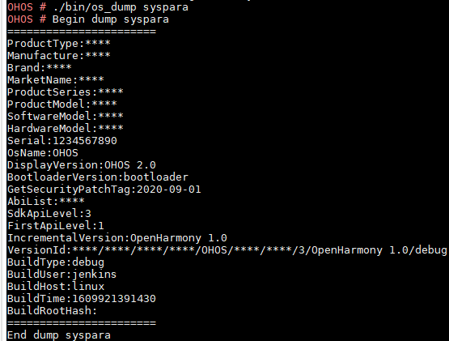

# 公共基础库开发指导<a name="ZH-CN_TOPIC_0000001059307279"></a>

-   [接口说明](#section1633115419401)
-   [开发步骤](#section17450172710292)
    -   [LiteOS-A内核\(Hi3516、Hi3518平台\)KV存储的native应用开发步骤：](#section258354119295)
    -   [Dump系统属性在LiteOS-M内核平台使用指南：](#section9179161863014)
    -   [Dump系统属性在LiteOS-A内核平台使用指南：](#section3179121853017)


## 接口说明<a name="section1633115419401"></a>

**表 1**  文件操作接口说明

<a name="table1171894475019"></a>
<table><thead align="left"><tr id="row1471814441508"><th class="cellrowborder" valign="top" width="45.65%" id="mcps1.2.3.1.1"><p id="p11718174425016"><a name="p11718174425016"></a><a name="p11718174425016"></a>接口名</p>
</th>
<th class="cellrowborder" valign="top" width="54.35%" id="mcps1.2.3.1.2"><p id="p6718124475013"><a name="p6718124475013"></a><a name="p6718124475013"></a>描述</p>
</th>
</tr>
</thead>
<tbody><tr id="row671818445506"><td class="cellrowborder" valign="top" width="45.65%" headers="mcps1.2.3.1.1 "><p id="p871814441501"><a name="p871814441501"></a><a name="p871814441501"></a>int UtilsFileOpen(const char* path, int oflag, int mode)</p>
</td>
<td class="cellrowborder" valign="top" width="54.35%" headers="mcps1.2.3.1.2 "><p id="p127181444165016"><a name="p127181444165016"></a><a name="p127181444165016"></a>打开或创建文件</p>
</td>
</tr>
<tr id="row1171874420507"><td class="cellrowborder" valign="top" width="45.65%" headers="mcps1.2.3.1.1 "><p id="p1671884419509"><a name="p1671884419509"></a><a name="p1671884419509"></a>int UtilsFileClose(int fd)</p>
</td>
<td class="cellrowborder" valign="top" width="54.35%" headers="mcps1.2.3.1.2 "><p id="p1071884416504"><a name="p1071884416504"></a><a name="p1071884416504"></a>关闭文件</p>
</td>
</tr>
<tr id="row6718744105017"><td class="cellrowborder" valign="top" width="45.65%" headers="mcps1.2.3.1.1 "><p id="p137181644145015"><a name="p137181644145015"></a><a name="p137181644145015"></a>int UtilsFileRead(int fd, char *buf, unsigned int len)</p>
</td>
<td class="cellrowborder" valign="top" width="54.35%" headers="mcps1.2.3.1.2 "><p id="p1171854410509"><a name="p1171854410509"></a><a name="p1171854410509"></a>读取特定长度的文件数据</p>
</td>
</tr>
<tr id="row2071817440509"><td class="cellrowborder" valign="top" width="45.65%" headers="mcps1.2.3.1.1 "><p id="p17718144465012"><a name="p17718144465012"></a><a name="p17718144465012"></a>int UtilsFileWrite(int fd, const char *buf, unsigned int len)</p>
</td>
<td class="cellrowborder" valign="top" width="54.35%" headers="mcps1.2.3.1.2 "><p id="p67191444145012"><a name="p67191444145012"></a><a name="p67191444145012"></a>向文件写入特定大小的数据</p>
</td>
</tr>
<tr id="row471974425019"><td class="cellrowborder" valign="top" width="45.65%" headers="mcps1.2.3.1.1 "><p id="p11719174475016"><a name="p11719174475016"></a><a name="p11719174475016"></a>int UtilsFileDelete(const char *path)</p>
</td>
<td class="cellrowborder" valign="top" width="54.35%" headers="mcps1.2.3.1.2 "><p id="p2071919446507"><a name="p2071919446507"></a><a name="p2071919446507"></a>删除指定文件</p>
</td>
</tr>
<tr id="row1071964425013"><td class="cellrowborder" valign="top" width="45.65%" headers="mcps1.2.3.1.1 "><p id="p20719114405010"><a name="p20719114405010"></a><a name="p20719114405010"></a>int UtilsFileStat(const char *path, unsigned int *fileSize)</p>
</td>
<td class="cellrowborder" valign="top" width="54.35%" headers="mcps1.2.3.1.2 "><p id="p8719144435015"><a name="p8719144435015"></a><a name="p8719144435015"></a>获取文件大小</p>
</td>
</tr>
<tr id="row2071924417504"><td class="cellrowborder" valign="top" width="45.65%" headers="mcps1.2.3.1.1 "><p id="p57193447501"><a name="p57193447501"></a><a name="p57193447501"></a>int UtilsFileSeek(int fd, int offset, unsigned int whence)</p>
</td>
<td class="cellrowborder" valign="top" width="54.35%" headers="mcps1.2.3.1.2 "><p id="p1071934495014"><a name="p1071934495014"></a><a name="p1071934495014"></a>重新定位文件读/写偏移量</p>
</td>
</tr>
<tr id="row1135017417557"><td class="cellrowborder" valign="top" width="45.65%" headers="mcps1.2.3.1.1 "><p id="p2350184112554"><a name="p2350184112554"></a><a name="p2350184112554"></a>int UtilsFileCopy(const char* src, const char* dest)</p>
</td>
<td class="cellrowborder" valign="top" width="54.35%" headers="mcps1.2.3.1.2 "><p id="p113501041155511"><a name="p113501041155511"></a><a name="p113501041155511"></a>将源文件复制一份并存储到目标文件</p>
</td>
</tr>
<tr id="row11216645145517"><td class="cellrowborder" valign="top" width="45.65%" headers="mcps1.2.3.1.1 "><p id="p192171345105519"><a name="p192171345105519"></a><a name="p192171345105519"></a>int UtilsFileMove(const char* src, const char* dest)</p>
</td>
<td class="cellrowborder" valign="top" width="54.35%" headers="mcps1.2.3.1.2 "><p id="p921744595517"><a name="p921744595517"></a><a name="p921744595517"></a>将源文件移动到指定目标文件</p>
</td>
</tr>
</tbody>
</table>

文件操作使用示例：

```
// open && write
char fileName[] = "testfile";
static const char def[] = "utils_file_operation implement.";
int fd = UtilsFileOpen(fileName, O_RDWR_FS | O_CREAT_FS | O_TRUNC_FS, 0);
printf("file handle = %d\n", fd);
int ret = UtilsFileWrite(fd, def, strlen(def));
printf("write ret = %d\n", ret);

// seek
ret = UtilsFileSeek(fd, 5, SEEK_SET_FS);
printf("lseek ret = %d\n", ret);

// read && close
char buf[64] = {0};
int readLen = UtilsFileRead(fd, buf, 64);
ret = UtilsFileClose(fd);
printf("read len = %d : buf = %s\n", readLen, buf);

// stat
int fileLen = 0;
ret = UtilsFileStat(fileName, &fileLen);
printf("file size = %d\n", fileLen);

// delete
ret = UtilsFileDelete(fileName);
printf("delete ret = %d\n", ret);
```

**表 2**  KV存储接口说明

<a name="table1731550155318"></a>
<table><thead align="left"><tr id="row4419501537"><th class="cellrowborder" valign="top" width="57.38999999999999%" id="mcps1.2.3.1.1"><p id="p54150165315"><a name="p54150165315"></a><a name="p54150165315"></a>接口名</p>
</th>
<th class="cellrowborder" valign="top" width="42.61%" id="mcps1.2.3.1.2"><p id="p941150145313"><a name="p941150145313"></a><a name="p941150145313"></a>描述</p>
</th>
</tr>
</thead>
<tbody><tr id="row34145016535"><td class="cellrowborder" valign="top" width="57.38999999999999%" headers="mcps1.2.3.1.1 "><p id="p980953910190"><a name="p980953910190"></a><a name="p980953910190"></a>int UtilsGetValue(const char* key, char* value, unsigned int len)</p>
</td>
<td class="cellrowborder" valign="top" width="42.61%" headers="mcps1.2.3.1.2 "><p id="p13562171015712"><a name="p13562171015712"></a><a name="p13562171015712"></a>提供给上层应用根据key获取对应数据项</p>
</td>
</tr>
<tr id="row1746172917474"><td class="cellrowborder" valign="top" width="57.38999999999999%" headers="mcps1.2.3.1.1 "><p id="p242913617818"><a name="p242913617818"></a><a name="p242913617818"></a>int UtilsSetValue(const char* key, const char* value)</p>
</td>
<td class="cellrowborder" valign="top" width="42.61%" headers="mcps1.2.3.1.2 "><p id="p2431455765"><a name="p2431455765"></a><a name="p2431455765"></a>提供给上层应用用于存储/更新key对应数据项</p>
</td>
</tr>
<tr id="row10992232154714"><td class="cellrowborder" valign="top" width="57.38999999999999%" headers="mcps1.2.3.1.1 "><p id="p118151439111910"><a name="p118151439111910"></a><a name="p118151439111910"></a>int UtilsDeleteValue(const char* key)</p>
</td>
<td class="cellrowborder" valign="top" width="42.61%" headers="mcps1.2.3.1.2 "><p id="p126575774517"><a name="p126575774517"></a><a name="p126575774517"></a>提供给上层应用删除key对应数据项</p>
</td>
</tr>
</tbody>
</table>

KV存储使用示例：

```
// set
char key[] = "rw.sys.version_100";
char value[] = "Hello kv operation implement!";
int ret = UtilsSetValue(key, value);
printf("UtilsSetValue set ret = %d\n", ret);

// get
char temp[128] = {0};
ret = UtilsGetValue(key, temp, 128);
printf("UtilsGetValue get ret = %d, temp = %s\n", ret, temp);

// delete
ret = UtilsDeleteValue(key);
printf("UtilsDeleteValue delete ret = %d\n", ret);
```

<a name="table15992315220"></a>
<table><thead align="left"></thead>
<tbody></tbody>
</table>

## 开发步骤<a name="section17450172710292"></a>

### LiteOS-A内核\(Hi3516、Hi3518平台\)KV存储的native应用开发步骤：<a name="section258354119295"></a>

1.  基于AbilityKit开发KV存储的native应用。
    -   基于KV存储提供的接口编写用户程序，并编译出so（libLauncher.so）文件。

        ```
        // set
        char key[] = "rw.sys.version_100";
        char value[] = "Hello kv operation implement!";
        int ret = UtilsSetValue(key, value);
        printf("UtilsSetValue set ret = %d\n", ret);
        
        // get
        char temp[128] = {0};
        ret = UtilsGetValue(key, temp, 128);
        printf("UtilsGetValue get ret = %d, temp = %s\n", ret, temp);
        
        // delete
        ret = UtilsDeleteValue(key);
        printf("UtilsDeleteValue delete ret = %d\n", ret);
        ```

    -   编写config.json文件，内容如下：

        ```
        {
            "app": {
                "bundleName": "com.huawei.launcher",
                "vendor": "huawei",
                "version": {
                    "code": 1,
                    "name": "1.0"
                }
            },
            "deviceConfig": {
                "default": {
                    "reqSdk": {
                        "compatible": "zsdk 1.0.0",
                        "target": "zsdk 1.0.1"
                    },
                    "keepAlive": false
                },
                "smartCamera": {
                    "reqSdk": {
                        "compatible": "zsdk 1.0.0",
                        "target": "zsdk 1.0.1"
                    },
                    "keepAlive": false
                }
            },
            "module": {
                "package": "com.huawei.launcher",
                "name": ".MyHarmonyAbilityPackage",
                "deviceType": [
                    "phone", "tv","tablet", "pc","car","smartWatch","sportsWatch","smartCamera"
                ], 
                "distro": {
                    "deliveryWithInstall": true, 
                    "moduleName": "Launcher", 
                    "moduleType": "entry"
                },
                "abilities": [{
                    "name": "MainAbility",
                    "icon": "res/drawable/phone.png",
                    "label": "test app 1", 
                    "launchType": "standard",
                    "type": "page"
                },
                {
                    "name": "SecondAbility",
                    "icon": "res/drawable/phone.png",
                    "label": "test app 2", 
                    "launchType": "standard",
                    "type": "page"
                },
                {
                    "name": "ServiceAbility",
                    "icon": "res/drawable/phone.png",
                    "label": "test app 2", 
                    "launchType": "standard",
                    "type": "service"
                }
                ]
            }
        }
        ```


    -   生成hap包。

        -   按照如下目录结构存放文件，res/drawable下面放置资源文件：

        

        -   将上述文件打包生成zip包，修改后缀为.hap，例如Launcher.hap


2.  连接单板，通过串口向单板发送安装KV存储native应用的命令。

    ```
    ./nfs/dev_tools/bin/bm install -p /nfs/Launcher.hap
    ```

3.  通过串口向单板发送运行KV存储native应用的命令。

    ```
    ./nfs/dev_tools/bin/aa start -p com.huawei.launcher -n ServiceAbility
    ```


### Dump系统属性在LiteOS-M内核平台使用指南：<a name="section9179161863014"></a>

1.  连接单板，通过串口向单板发送AT+SYSPARA命令。

    ```
    AT+SYSPARA
    ```

    **图 1**  LiteOS-M平台dump系统属性输出<a name="fig15179161863016"></a>  
    


### Dump系统属性在LiteOS-A内核平台使用指南：<a name="section3179121853017"></a>

1.  连接单板，运行bin路径下的os\_dump加参数--help，查看os\_dump使用指导。

    ```
    ./bin/os_dump --help
    ```

2.  os\_dump加参数-l，查看当前系统有哪些模块支持获取属性。

    ```
    ./bin/os_dump -l
    ```

3.  os\_dump加参数syspara，查看当前系统属性

    ```
    ./bin/os_dump syspara
    ```

    **图 2**  LiteOS-A平台dump系统属性输出<a name="fig2179718143018"></a>  
    


