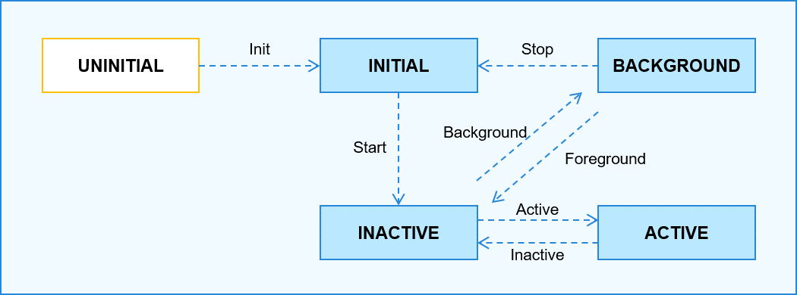
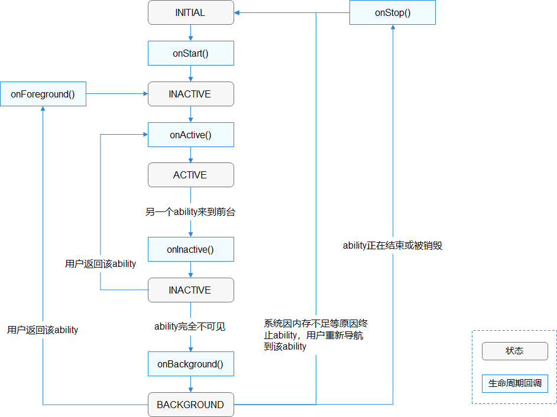
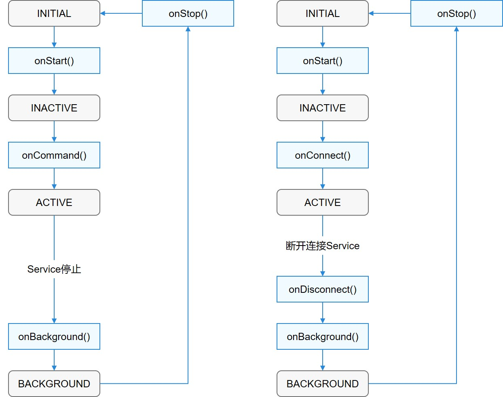

# 元能力子系统

## 简介

**元能力子系统**实现对Ability的运行及生命周期进行统一的调度和管理，应用进程能够支撑多个Ability，Ability具有跨应用进程间和同一进程内调用的能力。Ability管理服务统一调度和管理应用中各Ability，并对Ability的生命周期变更进行管理。


**元能力子系统架构图说明：**

- **Ability Kit**为Ability的运行提供基础的运行环境支撑。Ability是系统调度应用的最小单元，是能够完成一个独立功能的组件，一个应用可以包含一个或多个Ability。Ability分为FA（Feature Ability）和PA（Particle Ability）两种类，其中FA支持Page Ability，PA支持Service Ability和Data Ability。

- **Ability管理服务（AbilityManagerService）**：用于协调各Ability运行关系、及对生命周期进行调度的系统服务。
  - Ability栈管理模块（AbilityStackManager）负责维护各个Ability之间跳转的先后关系。
  - 连接管理模块（AbilityConnectManager）是Ability管理服务对Service类型Ability连接管理的模块。
  - 数据管理模块（DataAbilityManager）是Ability管理服务对Data类型Ability管理的模块。
  - App管理服务调度模块（AppScheduler）提供Ability管理服务对用户程序管理服务进行调度管理的能力。
  - Ability调度模块（AbilityScheduler）提供对Ability进行调度管理的能力。
  - 生命周期调度模块（LifecycleDeal）是Ability管理服务对Ability的生命周期事件进行管理调度的模块。

**Ability生命周期介绍**（Ability Life Cycle）是Ability被调度到INACTIVE、ACTIVE、BACKGROUND等各个状态的统称（主要涉及PageAbility类型和ServiceAbility类型的Ability）。

  - **PageAbility类型的Ability生命周期流转如下图所示**




  - **ServiceAbility类型的Ability生命周期流转如下图所示**


**Ability生命周期状态说明：**

  - **UNINITIALIZED**：未初始状态，为临时状态，Ability被创建后会由UNINITIALIZED状态进入INITIAL状态。

  - **INITIAL**：初始化状态，也表示停止状态，表示当前Ability未运行，Ability被启动后由INITIAL态进入INACTIVE状态。

  - **INACTIVE**：未激活状态，表示当前窗口已显示但是无焦点状态，由于Window暂未支持焦点的概念，当前状态与ACTIVE一致。

  - **ACTIVE**：前台激活状态，表示当前窗口已显示，并获取焦点，Ability在退到后台之前先由ACTIVE状态进入INACTIVE状态。

  - **BACKGROUND**: 后台状态，表示当前Ability退到后台，Ability在被销毁后由BACKGROUND状态进入INITIAL状态，或者重新被激活后由BACKGROUND状态进入ACTIVE状态。

**PageAbility类型Ability生命周期回调如下图所示：**




**ServiceAbility类型Ability生命周期回调如下图所示:**




## 目录

```
foundation/
└──foundation/aafwk/standard
   ├── frameworks
   │   └── kits
   │       └── ability						# AbilityKit实现的核心代码
   ├── interfaces
   │   └── innerkits
   │        └── want						# Ability之间交互的信息载体的对外接口
   └── services
       ├── abilitymgr						# Ability管理服务框架代码
       ├── common							# 日志组件目录
       ├── test								# 测试目录
       └── tools							# aa命令代码目录
```

## 使用说明

当前版本用户程序框架不具备权限管理的能力。

以下模块的JS接口为非正式API，仅供Launcher、Settings、SystemUI等系统应用使用，不排除对这些接口进行变更的可能性，后续版本将提供正式API。

- @ohos.feature_ability.d.ts

- @ohos.napi_ability_manager.d.ts

- abilityinfo.d.ts

- abilitymissioninfo.d.ts

- applicationinfo.d.ts

- appprocessstate.ts

- common.d.ts

- elementname.d.ts

- moduleinfo.d.ts

- processinfo.d.ts

- want.d.ts

## **aa命令**

**aa help**

| 命令    | 描述               |
| ------- | ------------------ |
| aa help | 显示aa命令帮助信息 |

**aa start**

| 命令                                                      | 描述                     |
| --------------------------------------------------------- | ------------------------ |
| aa start [-d <device>] -a <ability-name> -b <bundle-name> | 启动ability，设备ID 可空 |

```
示例：
aa start -d 12345 -a com.ohos.app.MainAbility -b com.ohos.app
```

**aa dump**

| 命令       | 描述                  |
| ---------- | --------------------- |
| aa dump -a | 打印栈中的Ability信息 |

## 相关仓
元能力子系统

[appexecfwk_standard ](https://gitee.com/openharmony/appexecfwk_standard)

[**aafwk_standard**](https://gitee.com/openharmony/aafwk_standard)

