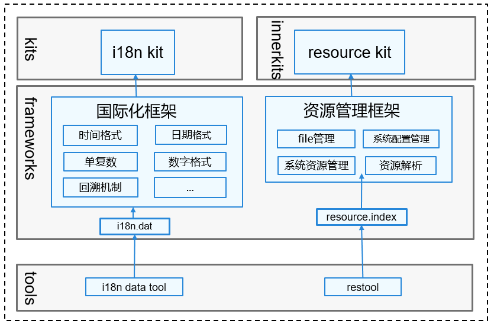

# 全球化子系统<a name="ZH-CN_TOPIC_0000001054438981"></a>

-   [简介](#section11516137123416)
-   [系统架构](#section8958681672)
-   [目录](#section1121775732114)
-   [约束](#section43112258019)
-   [相关仓](#section5889165803317)

## 简介<a name="section11516137123416"></a>

当OpenHarmony设备或应用在全球不同区域使用时，系统和应用需要满足不同市场用户关于语言、文化习俗的需求。全球化子系统提供支持多语言、多文化的能力，包括：

-   **资源管理能力：**

    根据设备类型、系统配置等信息，对系统资源和应用资源加载、解析和初始化，对外提供获取字符串、图片等资源的接口。


-   **国际化能力：**

    提供底层的资源回溯能力，同时对外提供丰富的国际化接口，包括时间日期格式化、数字格式、单复数等。


## 系统架构<a name="section8958681672"></a>

**图 1**  全球化子系统架构图<a name="fig1416834516101"></a>  




-   **resource kit**  为应用或其他子系统提供加载应用内置资源文件能力，当前该能力未对应用开放，只供其他子系统获取应用的框架资源。
-   **i18n kit**  为应用或其他子系统提供国际化能力接口，支持应用或子系统满足不同语言、不同国家地区用户的文化习惯。当前版本只提供时间日期、数字和单复数等能力的支持。
-   **i18n.dat**  为国际化框架提供不同语言、不同国家地区的时间、日期、数字等文化习俗的数据。

## 目录<a name="section1121775732114"></a>

```
/base/global/
├── i18n_lite                # 国际化框架代码仓
│   ├──  frameworks         # 国际化框架核心代码
│   │   ├── i18n           # 国际化模块
│   │   │   ├── include   # 接口文件
│   │   │   ├── src       # 实现代码
│   │   │   └── test      # 测试用例
│   ├──  interfaces         # 国际化框架接口
│   │   ├── kits           # 应用接口 
│   │   │   ├── i18n      # C/C++国际化能力接口
│   │   │   └── js        # javascript 接口的C/C++支持
├── resmgr_lite              # 资源管理框架代码仓
│   ├──  frameworks         # 资源管理框架核心代码
│   │   ├── resmgr         # 资源解析核心代码   
│   │   │   ├── include   # 接口文件
│   │   │   └── src       # 实现代码
│   ├──  interfaces         # 资源管理框架接口
│   │   └── innerkits      # 资源管理框架对子系统间接口
├── cust_lite                # 定制框架代码仓
│   ├── frameworks          # 定制框架核心代码
│   │   ├── cust_lite      # 定制框架模块
│   │   │   ├── src       # 实现代码
│   │   │   └── test      # 测试代码
│   ├── interfaces          # 定制框架接口
│   │   └── innerkits      # 定制框架子系统间接口
```

## 约束<a name="section43112258019"></a>

无。

## 相关仓<a name="section5889165803317"></a>

全球化子系统

hmf/global/i18n\_lite

hmf/global/resmgr\_lite

hmf/global/cust\_lite

