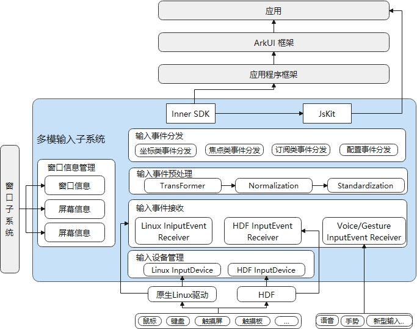

# 多模输入子系统<a name="ZH-CN_TOPIC_0000001086316185"></a>

-   [简介](#section11660541593)
-   [目录](#section14408467105)
-   [使用](#section18111235161011)
-   [相关仓](#section135327891219)

## 简介<a name="section11660541593"></a>

OpenHarmony旨在为开发者提供NUI（Natural User Interface）的交互方式，有别于传统操作系统的输入，在OpenHarmony上，我们将多种维度的输入整合在一起，开发者可以借助应用程序框架、系统自带的UI组件或API接口轻松地实现具有多维、自然交互特点的应用程序。

具体来说，多模输入子系统基于Linux原生驱动和HDF驱动接收设备输入事件，如键盘、鼠标、触摸屏、触摸板等，对输入事件进行归一化和标准化后通过innerkit分发到JS UI框架或用户程序框架，JS UI框架根据上报的事件再次封装，对应用提供接口。



## 目录<a name="section14408467105"></a>

```
/foundation/multimodalinput/input
├── common                       # 公共代码
├── interfaces                   # 对外接口存放目录
│   └── native                   # 对外native层接口存放目录
│       └── innerkits            # 对系统内部子系统提供native层接口存放目录
├── service                      # 服务框架代码
├── sa_profile                   # 服务启动配置文件
├── uinput                       # 输入事件注入模块
```

## 使用<a name="section18111235161011"></a>

### 接口说明<a name="section86358081116"></a>

多模输入目前提供的接口为按键事件注入接口，该接口目前仅对系统应用开放。

- inputEventClient是处理注入事件类。

  **表 1**  inputEventClient的主要接口

  <a name="t49c6a8df29a143a98ef6f66f43c7eac8"></a>

  <table><thead align="left"><tr id="rf815506c67654ad4ac014b339ee3292d"><th class="cellrowborder" valign="top" width="15.031503150315032%" id="mcps1.2.4.1.1"><p id="a59bc0498281e498289e11d5e584eb293"><a name="a59bc0498281e498289e11d5e584eb293"></a><a name="a59bc0498281e498289e11d5e584eb293"></a>功能分类</p>
  </th>
  <th class="cellrowborder" valign="top" width="23.152315231523154%" id="mcps1.2.4.1.2"><p id="aa1226795522e4609b6b1d210255beeff"><a name="aa1226795522e4609b6b1d210255beeff"></a><a name="aa1226795522e4609b6b1d210255beeff"></a>接口名</p>
  </th>
  <th class="cellrowborder" valign="top" width="61.816181618161814%" id="mcps1.2.4.1.3"><p id="a34777ce8d3174036ba45b9fd51dc4848"><a name="a34777ce8d3174036ba45b9fd51dc4848"></a><a name="a34777ce8d3174036ba45b9fd51dc4848"></a>描述</p>
  </th>
  </tr>
  </thead>
  <tbody><tr id="ra7599f41f04548858a77e2062aad2cf5"><td class="cellrowborder" valign="top" width="15.031503150315032%" headers="mcps1.2.4.1.1 "><p id="a63ab1186072d4bcdb32d4e11b9243b57"><a name="a63ab1186072d4bcdb32d4e11b9243b57"></a><a name="a63ab1186072d4bcdb32d4e11b9243b57"></a>事件注入接口</p>
  </td>
  <td class="cellrowborder" valign="top" width="23.152315231523154%" headers="mcps1.2.4.1.2 "><p id="a3d9b89df15074475a45ed26503e22c21"><a name="a3d9b89df15074475a45ed26503e22c21"></a><a name="a3d9b89df15074475a45ed26503e22c21"></a>function injectEvent(keyEvent: KeyEvent): number;</p>
  </td>
  <td class="cellrowborder" valign="top" width="61.816181618161814%" headers="mcps1.2.4.1.3 "><p id="a33c82952289f40a09773ce2fed14f6aa"><a name="a33c82952289f40a09773ce2fed14f6aa"></a><a name="a33c82952289f40a09773ce2fed14f6aa"></a>注入按键事件的接口</p>
  </td>
  </tr>
  </tbody>
  </table>


### 使用说明<a name="section789634518111"></a>

当前仅提供了BACK按键的事件注入。

当系统应用需要返回上一层时，通过注入接口将BACK键注入到多模服务，多模服务再上传到应用，以实现返回到上一层级目录的效果。使用方式如下所示：

```
// 引入提供的js接口库
import inputEventClient from '@ohos.multimodalInput.inputEventClient';

// 调用注入事件接口
let keyEvent = {
    isPressed: true,        // 按键事件的按键类型：true：down false：up
    keyCode: 2,             // 按键对应的keycode, 例如back键的值为2
    keyDownDuration: 0,     // 按键按下到抬起的时长，单位ms
    isIntercepted: false    // 标注是否拦截
}
res = inputEventClient.injectEvent({KeyEvent: keyEvent});
```

> **说明：**
>新增的接口能力需要兼容原有的能力。

### 设备能力支持<a name="section789634518112"></a>

|    设备     | 触摸屏 | 触摸板 | 鼠标 | 键盘 |
| :---------: | :----: | :----: | :--: | :--: |
|   rk3568    |   Y    |   Y    |  Y   |  Y   |
| hi3516dv300 |   Y    |   N    |  N   |  N   |

## 相关仓<a name="section135327891219"></a>

**多模输入子系统**

multimodalinput\_input

