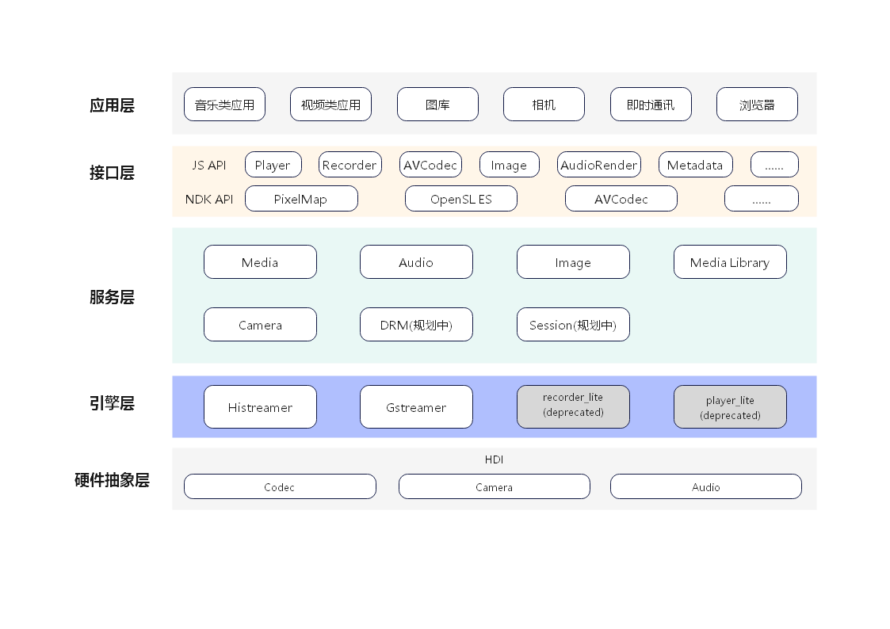

# 媒体子系统<a name="ZH-CN_TOPIC_0000001078026808"></a>

-   [简介](#section11660541593)
-   [系统架构](#section11660541594)
-   [目录](#section161941989596)
-   [约束](#section119744591305)
-   [使用说明](#section1312121216216)
-   [安装](#section11914418405)
-   [相关仓](#section1371113476307)

## 简介<a name="section11660541593"></a>

媒体子系统为开发者提供一套简单且易于理解的接口，使得开发者能够方便接入系统并使用系统的媒体资源。

媒体子系统包含了音视频、相机相关媒体业务，提供以下常用功能：

-   音频播放和录制。
-   视频播放和录制。
-   相机拍照和录制。

## 系统架构<a name="section11660541594"></a>

**图 1**  OpenHarmony媒体子系统架构图<a name="fig99659301300"></a>  



- **Media**: 为应用提供播放、录制等接口，通过跨进程调用或直接调用方式，调用媒体引擎Gstreamer、Histreamer或其它引擎。
  - mini设备上，Media部件调用Histreamer支持音频播放等功能。
  - small设备上，Media部件调用recorder_lite支持音视频录制，默认调用player_lite支持音视频播放，通过设置系统属性变量debug.media_service.histreamer为1使用histreamer。详细设置方法参见[syspara系统属性组件使用说明](https://device.harmonyos.com/cn/docs/documentation/guide/subsys-boot-syspara-0000001063362360)或者参见[syspara模块代码](https://gitee.com/openharmony/startup_syspara_lite)。
  - standard设备上，Media部件调用Gstreamer支持音视频播放、音视频录制。
- **Audio**: Audio部件支持音频输入输出、策略管理、音频焦点管理等功能。
- **Camera**: Camera部件提供相机操作接口，支持预览、拍照、录像。
- **Image**: Image部件支持常见图片格式的编解码。
- **MediaLibrary**: MediaLibrary支持本地和分布式媒体数据访问管理。
- **Histreamer**: 轻量级媒体引擎，支持文件/网络流媒体输入，支持音视频解码播放，支持音视频编码录制，支持插件扩展。
- **Gstreamer**: 开源GStreamer引擎，支持流媒体、音视频播放、录制等功能。

## 目录<a name="section161941989596"></a>

仓目录结构如下：

```
/foundation/multimedia                                 # 媒体子系统业务代码
├── audio_lite                                         # 小型系统音频模块
│   ├── figures                                        # 小型系统音频架构和流程图
│   ├── frameworks                                     # 小型系统音频框架实现
│   └── interfaces                                     # 小型系统音频模块接口
├── audio_standard                                     # 标准系统音频模块
│   ├── figures                                        # 标准系统音频架构和流程图
│   ├── frameworks                                     # 标准系统音频框架实现
│   ├── interfaces                                     # 标准系统音频模块接口
│   ├── sa_profile                                     # 标准系统音频服务配置
│   └── services                                       # 标准系统音频服务实现
├── camera_lite                                        # 小型系统相机模块
│   ├── figures                                        # 小型系统相机架构和流程图
│   ├── frameworks                                     # 小型系统相机框架实现
│   └── interfaces                                     # 小型系统相机模块接口
├── camera_standard                                    # 标准系统相机模块
│   ├── figures                                        # 标准系统相机架构和流程图
│   ├── frameworks                                     # 标准系统相机框架实现
│   └── interfaces                                     # 标准系统相机模块接口
├── media_lite                                         # 小型系统播放录制模块
│   ├── figures                                        # 小型系统播放录制架构和流程图
│   ├── frameworks                                     # 小型系统播放录制框架实现
│   ├── interfaces                                     # 小型系统播放录制模块接口
│   └── services                                       # 小型系统播放录制模块服务
├── media_standard                                     # 标准系统播放录制模块
│   ├── figures                                        # 标准系统播放录制架构和流程图
│   ├── frameworks                                     # 标准系统播放录制框架实现
│   └── interfaces                                     # 标准系统播放录制模块接口
├── histreamer                                         # HiStreamer媒体引擎
│   └── engine                                         # 媒体引擎
│       ├── player                                     # 播放器封装
│       ├── foundation                                 # 基础工具
│       ├── pipeline                                   # Pipeline框架
│       └── plugin                                     # 插件框架
│           └── plugins                                # 平台软件插件
└── utils                                              # 媒体公共模块
    └── lite                                           # 小型系统媒体公共模块
        ├── figures                                    # 小型系统媒体公共模块架构和流程图
        ├── hals                                       # 小型系统媒体公共硬件抽象接口
        ├── interfaces                                 # 小型系统媒体公共模块接口
        └── src                                        # 小型系统媒体公共模块框架实现
```

## 约束<a name="section119744591305"></a>

部分音视频格式的硬件编码、解码功能依赖设备的支持。

## 使用说明<a name="section1312121216216"></a>

如架构图示意，媒体提供了三大类功能接口，开发者可以根据使用诉求，综合使用一类或多类接口：

-   应用开发者使用媒体接口实现录像、预览和播放音视频，使用可以参考[多媒体开发指南](https://gitee.com/openharmony/docs/blob/master/zh-cn/device-dev/subsystems/subsys-multimedia.md)。
-   当使用简单播放录制功能时，可以使用Player和Recorder快速完成播放和录制功能。
-   提供了一组控制相机的有效接口，可以让用户方便开发使用相机。
-   开发者先创建camerakit组件对象，注册各种事件回调，这些事件回调是用来响应多媒体模块中事件响应的，之后调用创建camera就可以创建一个操作camera资源的对象，使用这个对象可以启动预览、录像或抓拍取流，及设置取流的相关参数。

## 安装<a name="section11914418405"></a>

请提前加载内核及相关驱动，参考内核及驱动子系统readme。

## 相关仓<a name="section1371113476307"></a>

[multimedia\_camera\_lite](https://gitee.com/openharmony/multimedia_camera_lite)

[multimedia\_audio\_lite](https://gitee.com/openharmony/multimedia_audio_lite)

[multimedia\_media\_lite](https://gitee.com/openharmony/multimedia_media_lite)

[multimedia\_utils\_lite](https://gitee.com/openharmony/multimedia_utils_lite)

[multimedia\_histreamer](https://gitee.com/openharmony/multimedia_histreamer)

[multimedia\_camera\_standard](https://gitee.com/openharmony/multimedia_camera_standard)

[multimedia\_audio\_standard](https://gitee.com/openharmony/multimedia_audio_standard)

[multimedia\_media\_standard](https://gitee.com/openharmony/multimedia_media_standard)

