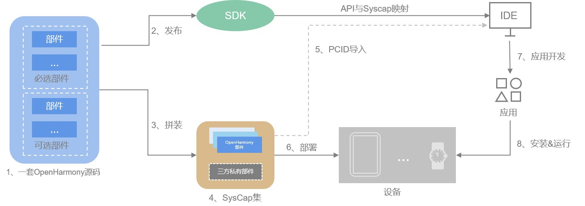

# SysCap使用指南

## 概述

### 系统能力与 API

SysCap，全称SystemCapability，即系统能力，指操作系统中每一个相对独立的特性，如蓝牙，WIFI，NFC，摄像头等，都是系统能力之一。每个系统能力对应多个 API，这些 API 绑定在一起，随着目标设备是否支持该系统能力共同存在或消失，也会随着 IDE 一起提供给开发者做联想。


### 支持能力集，联想能力集与要求能力集

支持能力集，联想能力集与要求能力集都是系统能力的集合。
支持能力集描述的是设备能力，要求能力集描述的是应用能力。若应用A的要求能力集是设备N的支持能力集的子集，则应用A可分发到设备N上安装运行，否则不能分发。
联想能力集是该应用开发时，IDE 可联想的 API 所在的系统能力集合。


### 设备与支持能力集

每个设备根据其硬件能力，对应不同的支持能力集。
鸿蒙 SDK 将设备分为两组，爆款设备和自定义设备，爆款设备的支持能力集由鸿蒙定义，自定义设备由设备厂商给出。


### 设备与SDK能力的对应

SDK 提供全量的 API 给 IDE，IDE 通过开发者的项目支持的设备，找到该设备的支持能力集，筛选支持能力集包含的 API 提供给开发者做联想。


## SysCap开发指导

### 配置联想能力集和要求能力集

IDE 会根据创建的工程所支持的设置自动配置联想能力集和要求能力集，开发者也可以自行修改。
对于联想能力集，开发者通过添加更多的系统能力，在 IDE 中可以使用更多的 API，但要注意这些 API 可能在设备上不支持，使用前需要判断。
对于要求能力集，开发者修改时要十分慎重，修改不当会导致应用无法分发到目标设备上。

```
/* syscap.json */
{
	devices: {
		general: [            /*每一个爆款设备对应一个syscap支持能力集，可配置多个爆款设备*/
			“phone”,
			"car,
			"pc",
			...
		],
		custom: [             /*厂家自定义设备*/
			{
				"美的油烟机": [
					"SystemCapability.Communication.SoftBus.Core",
					...
				]
			},
			...
		]
	},
	development: {             /*addedSysCaps内的sycap集合与devices中配置的各设备支持的syscap集合的并集共同构成联想能力集*/
		addedSysCaps: [
			"SystemCapability.Location.Location.Lite",
			...
		]
	},
	production: {              /*用于生成rpcid，慎重添加，可能导致应用无法分发到目标设备上*/
		addedSysCaps: [],      //devices中配置的各设备支持的syscap集合的交集，添加addedSysCaps集合再除去removedSysCaps集合，共同构成要求能力集
		removedSysCaps: []     //当该要求能力集为某设备的子集时，应用才可被分发到该设备上
	}
}
```


### 单设备应用开发

默认应用的联想能力集、要求系统能力集和设备的支持系统能力集相等，开发者修改要求能力集需要慎重。


### 跨设备应用开发

默认应用的联想能力集是多个设备支持能力集的并集，要求能力集则是交集。


### 判断 API 是否可以使用

首先我们定义了 API canIUse 帮助开发者来判断该工程是否支持某个特定的syscap。

```
if (canIUse("SystemCapability.ArkUI.ArkUI.Full")) {
	console.log("该应用支持SystemCapability.ArkUI.ArkUI.Full");
} else {
	console.log("该应用不支持SystemCapability.ArkUI.ArkUI.Full");
}
```

开发者可通过 import 的方式将模块导入，若当前设备不支持该模块，import 的结果为 undefined，开发者在使用其 API 时，需要判断其是否存在。

```
import geolocation from '@ohos.geolocation';

if (geolocation) {
	geolocation.getCurrentLocation((location) => {
		console.log(location.latitude, location.longitude);
	});
} else {
	console.log('该设备不支持位置信息')；
}
```


### 不同设备相同能力的差异检查

即使是相同的系统能力，在不同的设备下，也会有能力的差异。比如同是摄像头的能力，手机比手表要强很多。

```
import userAuth from '@ohos.userIAM.userAuth';

const authenticator = userAuth.getAuthenticator();
const result = authenticator.checkAbility('FACE_ONLY', 'S1');

if (result == authenticator.CheckAvailabilityResult.AUTH_NOT_SUPPORT) {
	console.log('该设备不支持人脸识别');
}
//强行调用不支持的 API 会返回错误信息，但不会出现语法错误。
authenticator.execute('FACE_ONLY', 'S1', (err, result) => {
	if (err) {
		console.log(err.message);
		return;
	}
})
```
### 设备间的SysCap差异如何产生的

设备的SysCap因产品解决方案厂商拼装的部件组合不同而不同，整体流程如下图：



1、一套OpenHarmony源码由可选和必选部件集组成，不同的部件为对外体现的系统能力不同，即部件与SysCap之间映射关系。

2、发布归一化的SDK，API与SysCap之间存在映射关系。

3、产品解决方案厂商按硬件能力和产品诉求，可按需拼装部件。

4、产品配置的部件可以是OpenHarmony的部件，也可以时三方开发的私有部件，由于部件与SysCap间存在映射，所有拼装后即可得到该产品的SysCap集合。


5、SysCap集编码生成PCID(Product Compatibility ID)对SysCap差异做对应处理，保证在不同设备上的兼容性。lity ID， 产品兼容性标识)，应用开发者可将PCID导入IDE得到某个产品的SysCap。

6、部署到设备上的系统参数中包含了SysCap集，系统提供了native的接口和应用接口，可供系统内的部件和应用查询某个SysCap是否存在。

7、应用开发过程中，应用必要的SysCap将被编码成RPCID（Required Product Compatibility ID），并写入应用安装包中。应用安装时，包管理器将解码RPCID得到应用需要的SysCap，与设备当前具备的SysCap比较，若应用要求的SysCap都被满足，则安装成功。

8、应用运行时，可通过canIUse接口查询设备的SysCap，保证在不同设备上的兼容性。
